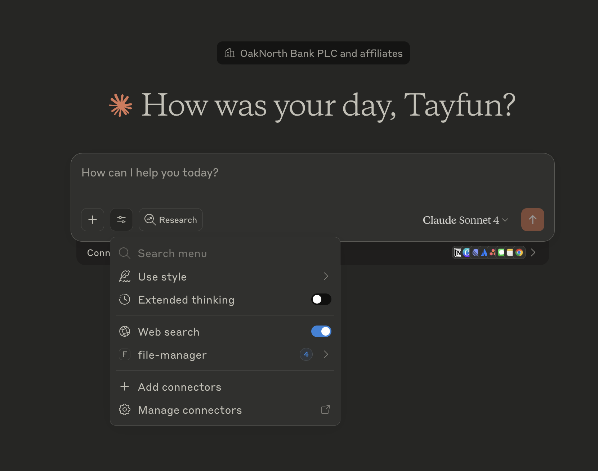

# Intro

This folder includes an example MCP server which simply lists files in a given directory.

# Installation

You need `uv` to setup the dependencies (only `mcp` at this point):

```bash
curl -LsSf https://astral.sh/uv/install.sh | sh
```

Once you have uv, you can run the MCP server yourself for testing:

```bash
uv run main.py
```

# Setting up with Claude

To let Claude Desktop app know about the new MCP server, you need to open file `claude_desktop_config.json`, change `uv` path and `main.py` directory to your local paths and copy the file:

```bash
cp ./code/example_mcp/claude_desktop_config.json ~/Library/Application\ Support/Claude/
```

Next time you open Claude Desktop App, you should see new tool listed. See [MCP docs](https://modelcontextprotocol.io/quickstart/server#test-with-commands) if you run into any issues.

You can also check MCP logs:

```bash
tail -f ~/Library/Logs/Claude/mcp.log
```

# Workshop - Let's MCP

## 1. Prerequisites

- Ensure you have Claude access (myapps sso should work)
- Install [Claude Desktop app](https://claude.ai/download)
- Install uv package manager (it's like `poetry` but better) using:

```
curl -LsSf https://astral.sh/uv/install.sh | sh
```

## 2. Test your MCP server

- Change to MCP directory:

```
cd ./code/example_mcp/
```

- You can simply run MCP server for testing with:
  `uv run main.py`
- How to know it is really working? `stdio` is the transport protocol, so it is simple as:

```
echo '{"jsonrpc":"2.0","method":"initialize","params":{"protocolVersion":"0.1.0","capabilities":{},"clientInfo":{"name":"test-client","version":"1.0.0"}},"id":1}' | uv run main.py | jq '.'
```

(Remove pipe to `jq` if you don't have it, or simply do `brew install jq` first)

## 3. Test Claude Desktop

- Change the path strings in config file to suit your own:

```
code claude_desktop_config.json
```

- Copy Claude config to correct location:

```
cp claude_desktop_config.json ~/Library/Application\ Support/Claude/
```

- Open Claude Desktop app and you should see our `file-manager` tools in `Search and Tools` section:

  

- Play around, ask it to code something for you, fix a bug or find a file...

## 4. New tools

- Think of a new tool that could be useful and implement it inside the `main.py` file
- Some ideas?
  - Connect it to [Jira](https://id.atlassian.com/manage-profile/security/api-tokens) to read or create tickets from LLM ✅
  - Let it read from a Confluence doc to answer questions 👩‍🏫
  - Poor man's RAG: read from wikipedia to answer a question - without hallucinations! 📚
  - Read today's weather from any one of Weather APIs so that Claude can tell you what to wear that day ☔️
  - Read your calendar to show your schedule and plan your day 📅
